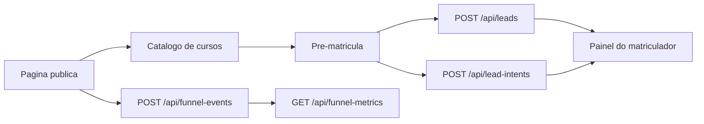

# Escola Tecnica Demo API

[](https://escola-tecnica-demo-front.vercel.app)
[](https://github.com/N1ghthill/escola-tecnica-demo-api)

Backend em Node.js + TypeScript para um funil educacional demonstrativo com catalogo, captura de leads, intencoes parciais e metricas de funil.

Este repositorio foi preparado como vitrine tecnica: a base operacional original foi sanitizada, os ativos sensiveis foram removidos e o projeto pode rodar em modo demo sem banco nem integracoes externas.

## Links rapidos

- Demo ao vivo do fluxo: `https://escola-tecnica-demo-front.vercel.app`
- Frontend demo: `https://github.com/N1ghthill/escola-tecnica-demo-front`

## O que este projeto demonstra

- Catalogo de cursos com payloads consistentes para paginas publicas.
- Captura de lead completo com protocolo e handoff para painel interno.
- Captura de intencoes parciais para abandono e pre-qualificacao.
- Dashboard de metricas de funil com resumo e series temporais.
- Autenticacao simples para o painel do matriculador.
- Modo demo para apresentacao sem dependencias externas.

## Fluxo funcional



## Endpoints principais

- `GET /api/health`
- `GET /api/courses`
- `POST /api/leads`
- `GET /api/leads`
- `PATCH /api/leads`
- `POST /api/lead-intents`
- `GET /api/lead-intents`
- `POST /api/funnel-events`
- `GET /api/funnel-metrics`
- `POST /api/payments`

## Rodando localmente

Modo demo, sem PostgreSQL:

```bash
npm install
DEMO_MODE=true MATRICULADOR_TOKEN=demo-token npm run dev
```

Modo local com banco:

```bash
npm install
docker compose up -d db
npm run db:setup
npm run dev
```

## Variaveis relevantes

- `DEMO_MODE` ou `APP_MODE=demo`
- `MATRICULADOR_TOKEN` ou `MATRICULADOR_TOKEN_SHA256(_LIST)`
- `FRONTEND_BASE_URL`
- `FRONTEND_ALLOWED_ORIGINS`
- `DATABASE_URL`
- `ENROLLMENT_FLOW_MODE`
- `ENABLE_ONLINE_PAYMENTS`

## Qualidade e testes

```bash
npm run check
```

Esse comando executa typecheck e a suite automatizada do projeto.

## Estrutura

- `api/`: handlers HTTP.
- `lib/`: regras de negocio, demo mode, seguranca e integracoes.
- `db/init/`: migracoes SQL para setup local.
- `tests/`: cobertura de CORS, idempotencia, respostas demo e seguranca.

## Notas de portfolio

- `POST /api/payments` permanece desativado por padrao.
- O modo demo responde com dados consistentes para exibicao no front e no painel.
- Esta copia publica nao inclui runbooks, segredos, dominios legados ou infraestrutura operacional.

## Licenca

Repositorio proprietario. Veja `LICENSE`.
